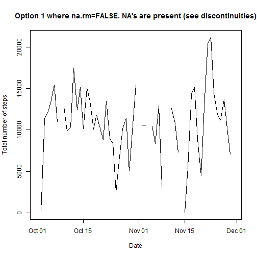
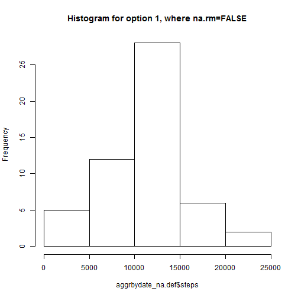
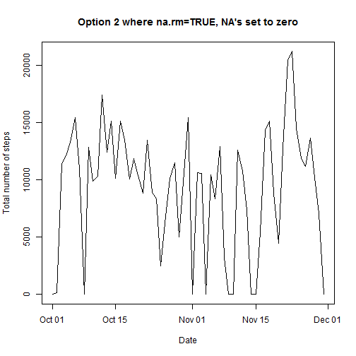
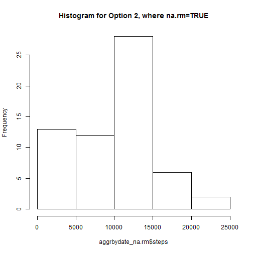
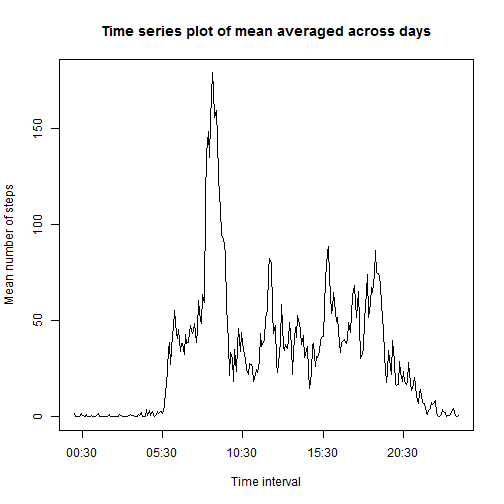
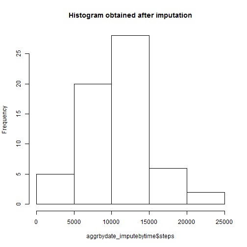
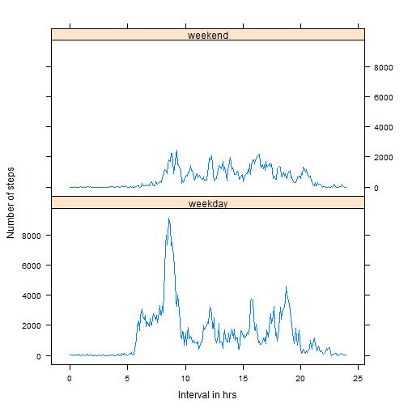

The objective of this assignment is to analyze walking patterns measured in 5-minute intervals over a 61 day period. The given dataset has 61 * 288 observations. The project has 5 parts, and the following sections contain the questions and the answers.

##Part 1 - Loading and preprocessing the data###

The dataset is loaded. The pre-processing involves converting the date, from a factor variable, to a date variable. Also, the interval is converted to time format.

```r
rawdata <- read.csv("activity.csv")
rawdata$date <- as.Date(rawdata$date)
# the interval is converted to time format by using the %% and %/% commands to get the hour and minute values. Using formatC, this is then obtained in 2 digit format and then pasted together using a colon, then the as.posixct command is invoked to get it in time fonat
rawdata$interval <- with( rawdata, paste0( formatC( (interval %/% 100),width=2,format="d",flag="0" ), ":", formatC( (interval %% 100),width=2,format="d",flag="0" ) ) )
rawdata$interval <- as.POSIXct(rawdata$interval, format='%H:%M')
```

##Part 2 - What is the mean total number of steps taken per day?##

I found that there are 2 ways to do the calculation which lead to somewhat slightly different results. The first option (**Option 1**) was the default option. Here the NA's are treated as missing values. This can be seen from the plots below. The median and mean with this option were 10800. The second option I tried, **Option 2**, used ```na.rm=TRUE```. What I observed was that this sets the NA's to zero - this can be seen from the plots below. In this case the median and mean are 10400 and 9350 respectively. Does this make sense? Yes. In the first case, the NA's were exclued from the calculation, whereas in the second, they were set to zero. This explains the lower median and mean.

##Option 1##

```r
# the three different commands below were found to be equivalent and produced the same result
# essentially, the numberof steps is aggregated by date
aggrbydate_na.def <- aggregate(x=list(steps=rawdata$steps),by=list(date=rawdata$date),FUN=sum)
plot(aggrbydate_na.def$date,aggrbydate_na.def$steps,type="l",xlab="Date",ylab="Total number of steps",main="Option 1 - NA's present")
```

 

```r
hist(aggrbydate_na.def$steps)
```

 

```r
summary(aggrbydate_na.def$steps)
```

```
##    Min. 1st Qu.  Median    Mean 3rd Qu.    Max.    NA's 
##      41    8840   10800   10800   13300   21200       8
```

##Option 2##


```r
aggrbydate_na.rm <- aggregate(x=list(steps=rawdata$steps),by=list(date=rawdata$date),FUN=sum, na.rm=TRUE)
plot(aggrbydate_na.rm$date,aggrbydate_na.rm$steps,type="l",xlab="Date",ylab="Total number of steps",main="Option 2 - NA's set to zero")
```

 

```r
hist(aggrbydate_na.rm$steps)
```

 

```r
summary(aggrbydate_na.rm$steps)
```

```
##    Min. 1st Qu.  Median    Mean 3rd Qu.    Max. 
##       0    6780   10400    9350   12800   21200
```

##Part 3- What is the average daily rawdata pattern?##

For this, the data was aggregated by time, and the time series data containing the 5 minute average was ploted. It was found that the interval which contains the maximum mumber of steps is the interval from 08:35AM to 08:40 AM

```r
# here the number of steps is aggregated time-wise
aggrbytime <- aggregate(x=list(steps=rawdata$steps),by=list(interval=rawdata$interval),FUN=sum,na.rm=TRUE)
aggrbytime$mn <- aggrbytime$steps/61 # Since 61 is the number of days
plot(aggrbytime$interval,aggrbytime$mn,type="l",xlab="Time interval",ylab="Mean number of steps",main="Time series plot of mean averaged across days")
```

 

```r
aggrbytime[which(aggrbytime$steps==max(aggrbytime$steps)),]
```

```
##                interval steps    mn
## 104 2014-11-16 08:35:00 10927 179.1
```

##Part 4 - Imputing missing values##

The number of missing values is 2304. For imputing, I used the method of imputing by time average. The median was 10400 and mean was 10600. By comparing these results with those in Option 1 and 2 of Question 3, we clearly see that the method of handling NA's strongly affects the results.

```r
summary(rawdata$steps)
```

```
##    Min. 1st Qu.  Median    Mean 3rd Qu.    Max.    NA's 
##     0.0     0.0     0.0    37.4    12.0   806.0    2304
```

**Method - Imputing by time average**

```r
rawdata_imputebytime <- rawdata #initialization
i=1
# the dataset is traversed using a for-loop. When an NA is found, I pick the interval value for that NA, then i find the index location of that time interval in the timewise aggregated dataset calculated for Question 3, get the (rounded) mean number-of-steps for that index, and then replace the NA with this mean value.
for ( i in (1:nrow(rawdata))) {
  if ( is.na(rawdata$steps[i]) ) {
    na.interval <- rawdata$interval[i]
    index <- which(aggrbytime$interval==na.interval)
    rawdata_imputebytime$steps[i] <- round(aggrbytime[index,"mn"])
    index <- integer()
  }
}
aggrbydate_imputebytime <- aggregate(x=list(steps=rawdata_imputebytime$steps), by=list(date=rawdata_imputebytime$date),FUN=sum)
hist(aggrbydate_imputebytime$steps)
```

 

```r
summary(aggrbydate_imputebytime$steps)
```

```
##    Min. 1st Qu.  Median    Mean 3rd Qu.    Max. 
##      41    9350   10400   10600   12800   21200
```

##Part 5 - Are there differences in activity patterns between weekdays and weekends? ##
For this part, a new variable "day" is added which has 2 levels - "weekday"" add "weekend". The dataset is then subsetted by this factor, and each of the subsets are aggregated, and plotted. From this we can see that there is a difference in the activity between weekdays and weekends, with more activity during weekdays compared to weekends.

```r
for ( i in (1:nrow(rawdata))) {  
if (weekdays(rawdata$date[i]) %in% c("Saturday","Sunday")) { rawdata$day[i] = "weekend"} 
else {rawdata$day[i] = "weekday"}
}

tmp <- aggregate(x=list(steps=rawdata$steps),by=list(day=rawdata$day,interval=rawdata$interval),FUN=sum,na.rm=TRUE)

xyplot(steps~interval|day,data=tmp,layout=c(1,2),type="l",ylab="Number of steps")
```

 
